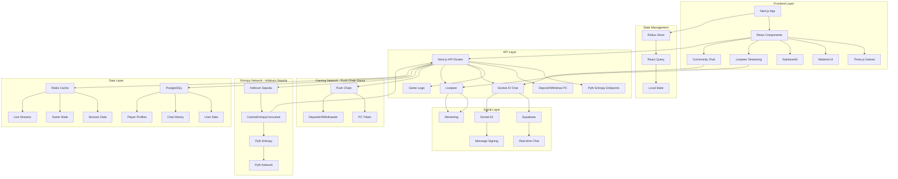
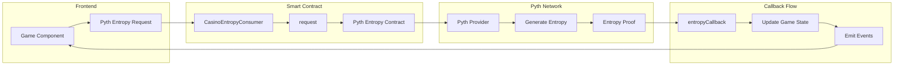
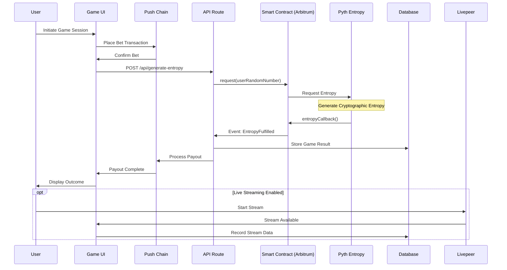
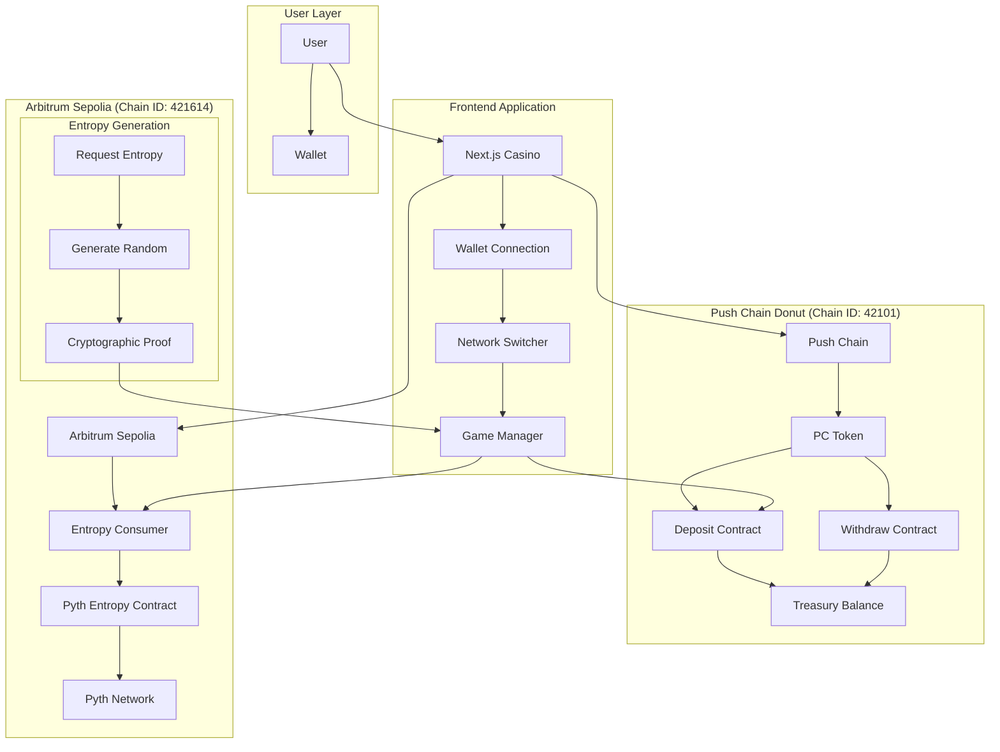

# APT Casino - Push Chain

A Universal casino platform built on Push Chain Donut Testnet with Pyth Entropy for provably fair gaming.

## 🎮 The Story Behind APT Casino

A few days ago, I was exploring transactions on Etherscan when I saw an advertisement for a popular centralized casino platform offering a 200% bonus on first deposits. I deposited 120 USDT and received 360 USDT in total balance in their custodial wallet.

When I started playing, I discovered I could only bet $1 per game and couldn't increase the amount. After contacting customer support, I learned I had been trapped by hidden "wager limits" tied to the bonus scheme. To withdraw my original deposit, I would need to play $12,300 worth of games!

In a desperate attempt to recover my funds, I played different games all night—roulette, mines, spin wheel—and lost everything.

This frustrating experience inspired APT Casino: a combination of GameFi, AI, and DeFi where users can enjoy casino games in a safe, secure, and transparent environment that doesn't scam its users.

## 🎯 The Problem

The traditional online gambling industry suffers from several issues:

- **Unfair Game Outcomes**: 99% of platforms manipulate game results, leading to unfair play
- **High Fees**: Exorbitant charges for deposits, withdrawals, and gameplay
- **Restrictive Withdrawal Policies**: Conditions that prevent users from accessing their funds
- **Misleading Bonus Schemes**: Trapping users with unrealistic wagering requirements
- **Lack of True Asset Ownership**: Centralized control over user funds
- **User Adoption Barriers**: Complexity of using wallets creates friction for web2 users
- **No Social Layer**: Lack of live streaming, community chat, and collaborative experiences

## 💡 Our Solution

APT Casino addresses these problems by offering:

- **Provably Fair Gaming**: Powered by Pyth Entropy

- **Multiple Games**: Wheel, Roulette, Plinko, and Mines with verifiable outcomes
- **Flexible Withdrawal**: Unrestricted access to funds
- **Transparent Bonuses**: Clear terms without hidden traps
- **True Asset Ownership**: Decentralized asset management
- **Live Streaming Integration**: Built with Livepeer, enabling real-time game streams and tournaments
- **On-Chain Chat**: Supabase + Socket.IO with wallet-signed messages for verifiable player communication
- **Gasless Gaming Experience**: Treasury-sponsored transactions for seamless web2-like experience

## 🌟 Key Features

### 1. Provably Fair Gaming

- **Pyth Entropy**: Cryptographically secure randomness
- **On-Chain Verification**: All game outcomes verifiable
- **Transparent Mechanics**: Open-source game logic

### 2. Multi-Chain Architecture

- **Gaming Network**: Push Chain Donut Testnet (Chain ID: 42101)
- **Entropy Network**: Arbitrum Sepolia (Chain ID: 421614)

### 3. Game Selection

- **Roulette**: European roulette with batch betting
- **Mines**: Strategic mine-sweeping with pattern betting
- **Plinko**: Physics-based ball drop with auto-betting features
- **Wheel**: Classic spinning wheel with multiple risk levels

### 4. Social Features

- **Live Streaming**: Integrated with Livepeer for real-time game streams and tournaments
- **On-Chain Chat**: Real-time communication with wallet-signed messages
- **Player Profiles**: NFT-based profiles with gaming history and achievements
- **Community Events**: Tournaments and collaborative gaming experiences

### 5. Web2 User Experience

- **Gasless Transactions**: Treasury-sponsored transactions eliminate gas fees
- **Seamless Onboarding**: Simplified wallet experience for web2 users
- **Familiar Interface**: Web2-like experience with web3 benefits

## 🚀 Getting Started

1. **Connect Wallet**: Connect your wallet to Push Chain Donut Testnet
2. **Get Tokens**: Get PC tokens from the Push Chain faucet
3. **Deposit**: Deposit PC to your house balance
4. **Play**: Start playing provably fair games!

### Network Configuration

Add Push Chain Donut Testnet to your wallet:
- **Network Name**: Push Chain Donut Testnet
- **RPC URL**: `https://evm.rpc-testnet-donut-node1.push.org/`
- **Chain ID**: `42101`
- **Currency Symbol**: `PC`
- **Block Explorer**: `https://donut.push.network`

## 🏗 System Architecture Overview

## 🎲 Pyth Entropy Integration Architecture

## 🎮 Game Execution Flow

## 🌐 Multi-Network Architecture (Push Chain + Arbitrum)

## 🔮 Future Roadmap

- **Mainnet Launch**: Deploying on push chain mainnet for real-world use after launch.
- **Additional Games**: Expanding the game selection
- **Enhanced DeFi Features**: Staking, farming, yield strategies
- **Developer Platform**: Allowing third-party game development
- **Advanced Social Features**: Enhanced live streaming and chat capabilities
- **ROI Share Links**: Shareable proof-links for withdrawals that render dynamic cards on social platforms
- **Tournament System**: Competitive gaming with leaderboards and prizes
- **Provably Fair**: All randomness verified on-chain via Pyth Entropy
- **Non-custodial**: Users maintain full control of their funds
- **Transparent**: All game logic and outcomes are verifiable

## 🔗 Links

- **Pitch Deck:** https://www.figma.com/slides/XVZxZ2Y91I9h9P8M7zMWL4/APT-Casino-Push?node-id=0-1&t=BIcQweSEa990geiI-1
- **Live URL:** https://apt-casino-push-chain.vercel.app/
